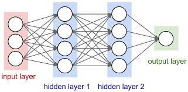

# Neural-Net-Banknote

A neural network code that uses a banknote dataset to predict the authenticity of a currency note. The dataset consist of features such as variance, Kurtosis, skew, entropy and class. A simple neural net with an architecture of an input layer consisting of four features (`variance`,`Kurtosis`,`skew`,`entropy`), an hidden layer, and an output layer (`class') was modeled for this purpose.

## Libraries:

<ul>
<li>csv</li>
<li>pandas</li>
<li>tensorflow</li>
<li>sklearn</li>
</ul>

